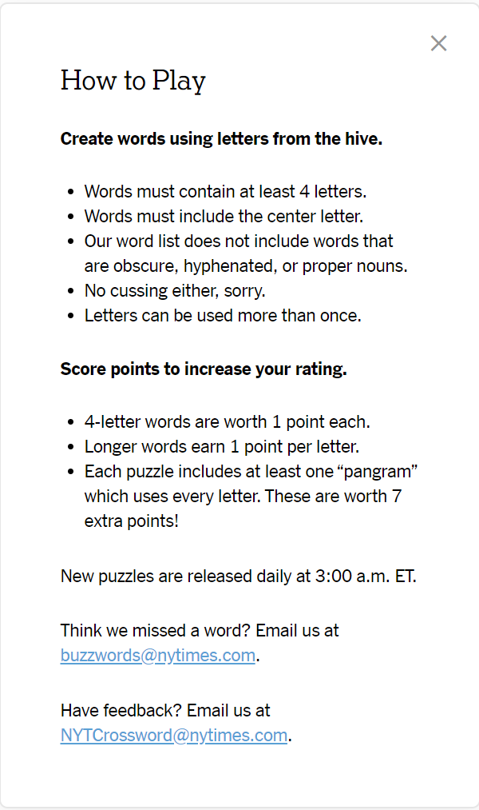
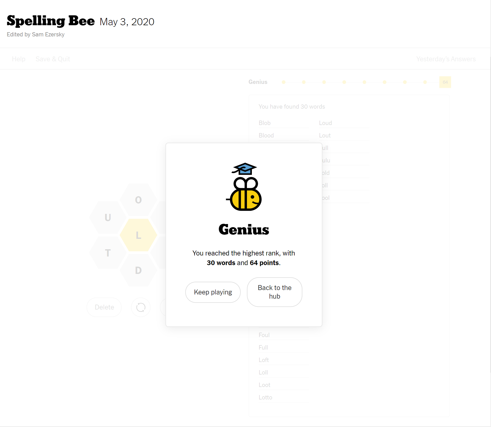

# NYTimes Spelling Bee Solver with NodeJS and MongoDB

- So I was reading news on New York Times app and came across this [spelling bee](https://www.nytimes.com/puzzles/spelling-bee) game. Frustrated by my poor vocabulary and time wasted on this annoying little game, I decided to write an app to solve it for me.

## Rules

- 

## List of Words

- As the rule suggests, NYTimes' word list "does not include words that are obscure, hyphenated, or proper nouns", so we also need a similar list. After a little googling, I found this [Mieliestronk's list of more than 58000 English words](http://www.mieliestronk.com/wordlist.html).

- The word list is downloaded and included in this repo, please see [corncob_lowercase.txt](./corncob_lowercase.txt).

## Database

- Obviously looping through the 58000 words list to find a word isn't efficient enough, so we probably need a database and build an index over all the words to speed up the query process.

- MongoDB isn't the only database that can do the job, it's just the one I preferred here. Most SQL or NoSQL database with the help of an index should be able to complete the word search task very quickly.

## Code Explaination

- [getDb.js](./getDb.js) connects to a MongoDB instance running on localhost on the default port 27017. Then retrieves the database instance called `spelling_bee`. If there's already a connection, return the current database instance.

- [buildDictionary.js](./buildDictionary.js) reads [corncob_lowercase.txt](./corncob_lowercase.txt) line by line and insert each word as a document with the field `word` into the collecton called `dictionary`. It also creates an index on the field `word`. MongoDB automatically creates the database and collection on first insertion if they not exist.

- [app.js](./app.js)
  1. reads all the letters and the center letter from command line input.
  1. push all the letters to a queue. The queue is used to store possible prefixes of the words we want to find.
  1. pop from the queue and append each letter to the item we poped, push the item back to the queue if it is a valid prefix of a word. Checking valid prefix is done by MongoDB `$regex` operator.
  1. if the item we poped from the queue has length greater or equal to 4 (words must contain at least 4 letters), and is a word in our database, we output the word to the command line.
  1. continue until the queue is empty, which means we have found all the words.

## How to Run

1. Download this project and install NodeJS and MongoDB on your computer.

1. Run `npm install` in the project directory to install packages.

1. Start a MongoDB instance on your local machine.

1. Run `node buildDictionary.js` to insert all the words into database.

1. Run `node app.js` to find the words:
   ```
   ...\spelling-bee> node app.js
   Type all the letters and then type the center letter, separate by space
   For example, "ltdobuf l"
   ltdobuf l
   Connected to MongoDB!
   loll
   loot
   lout
   loud
   loft
   lull
   lulu
   ludo
   toll
   told
   tool
   doll
   dolt
   dull
   blot
   blob
   bolt
   bold
   bull
   bulb
   flub
   fold
   fool
   foul
   full
   lotto
   blood
   bluff
   flood
   flout
   fluff
   doubtful
   ```

## Results

- 
